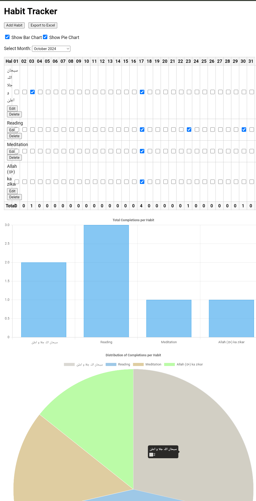

# Monthly Tracker



## Overview

**Monthly Tracker** is a versatile and user-friendly web application designed to help you monitor and visualize various aspects of your daily life. Whether you're aiming to build new habits, track attendance, or manage other repetitive tasks, Monthly Tracker provides an intuitive interface with powerful features to keep you organized and motivated.

## Features

- **Habit Tracking:** Monitor your daily habits with ease. Add, edit, and delete habits to customize your tracking experience.
- **Attendance Tracking:** Keep track of attendance for classes, meetings, or any other events.
- **Dynamic Tables:** View your progress in a structured table format with days as columns and habits as rows.
- **Interactive Checkboxes:** Mark the completion of habits or attendance for each day with simple checkboxes.
- **Local Storage:** All your data is securely stored in your browser's local storage, ensuring persistence across sessions.
- **Export to Excel:** Easily export your monthly or entire tracking data to Excel for further analysis or record-keeping.
- **Data Visualization:** Gain insights with dynamic bar and pie charts that represent your data visually.
- **Show/Hide Charts:** Customize your view by toggling the visibility of charts as per your preference.
- **Responsive Design:** Access and manage your tracker seamlessly across various devices and screen sizes.

## Possible Uses

While Monthly Tracker is primarily designed for habit tracking, its flexibility allows it to be used for a variety of purposes, including but not limited to:

- **Attendance Tracking:** Monitor attendance for classes, work meetings, or events.
- **Fitness Goals:** Track your workouts, runs, or other fitness activities.
- **Study Schedule:** Keep a log of study hours, subjects covered, and progress made.
- **Project Management:** Manage daily tasks and milestones for projects.
- **Medication Reminders:** Ensure you never miss a dose by tracking your medication schedule.
- **Reading Logs:** Keep track of books read, pages per day, or reading goals.
- **Diet Tracking:** Monitor your daily meals, calorie intake, and dietary habits.

## Demo


## Installation

1. **Clone the Repository:**

   ```bash
   git clone https://github.com/yasinULLAH/Monthly-tracker.git
   ```

2. **Navigate to the Project Directory:**

   ```bash
   cd Monthly-tracker
   ```

3. **Open the Application:**

   Open the `index.html` file in your preferred web browser.

## Usage

1. **Select Month:** Use the month selector to choose the month you want to track.

2. **Manage Habits:**
   - **Add Habit:** Click the "Add Habit" button, enter the habit name, and save.
   - **Edit Habit:** Click the "Edit" button next to a habit, modify the name, and save.
   - **Delete Habit:** Click the "Delete" button next to a habit and confirm the deletion.

3. **Track Progress:** Check the boxes corresponding to the days you completed a habit or attended an event. View dynamic totals per habit and per day at the end of the table.

4. **Visualize Data:** Toggle the visibility of bar and pie charts using the checkboxes. Analyze your progress through visual representations.

5. **Export Data:** Click the "Export to Excel" button to download your tracking data. Choose to export data on a monthly basis or the entire dataset.

## Technologies Used

- **HTML5 & CSS3:** For structuring and styling the application.
- **JavaScript:** For dynamic functionality and interactivity.
- **Chart.js:** For creating interactive bar and pie charts.
- **SheetJS (xlsx):** For exporting data to Excel files.
- **LocalStorage:** For data persistence across sessions.

## Contributing

Contributions are welcome! If you'd like to enhance Monthly Tracker, please follow these steps:

1. **Fork the Repository**

2. **Create a Feature Branch**

   ```bash
   git checkout -b feature/YourFeature
   ```

3. **Commit Your Changes**

   ```bash
   git commit -m "Add Your Feature"
   ```

4. **Push to the Branch**

   ```bash
   git push origin feature/YourFeature
   ```

5. **Open a Pull Request**

## License

This project is licensed under the [MIT License](LICENSE).

## Contact

For any inquiries or feedback, please contact [Yasin Ullah](https://github.com/yasinULLAH) at yking.kahn@gmail.com.
